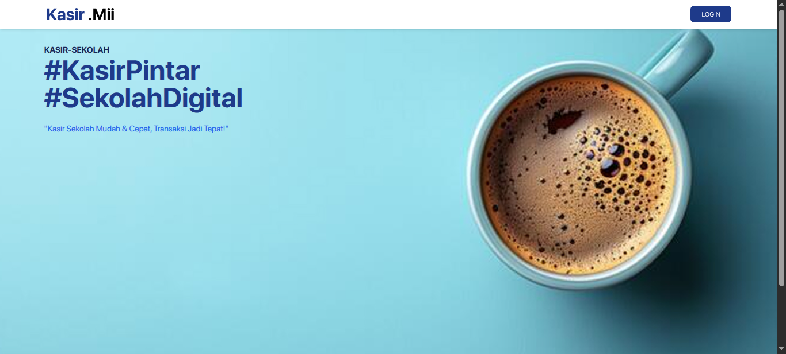
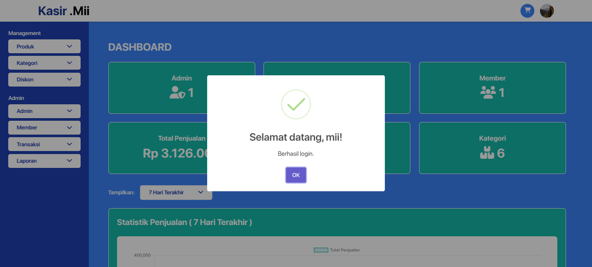
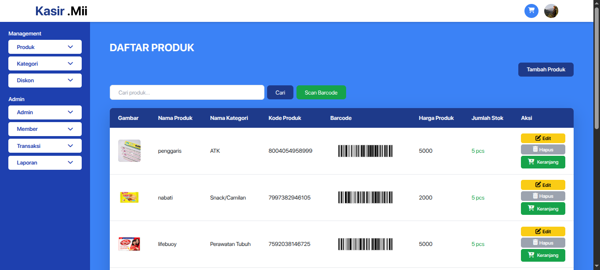
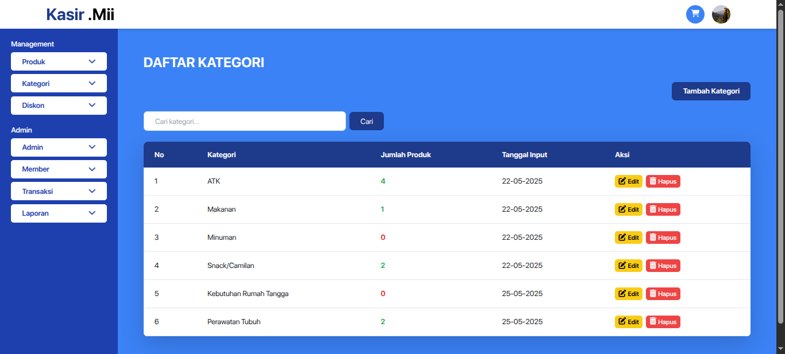
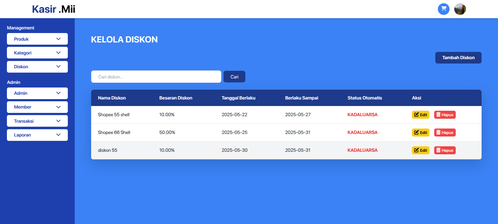
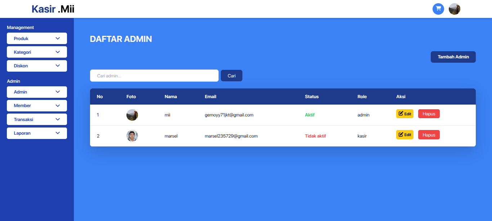
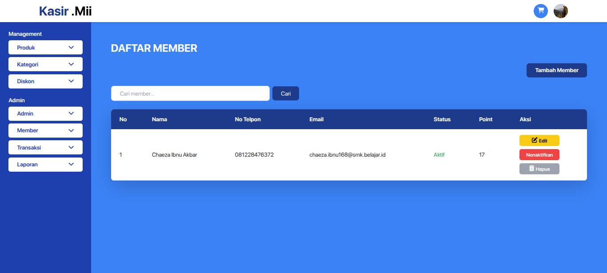
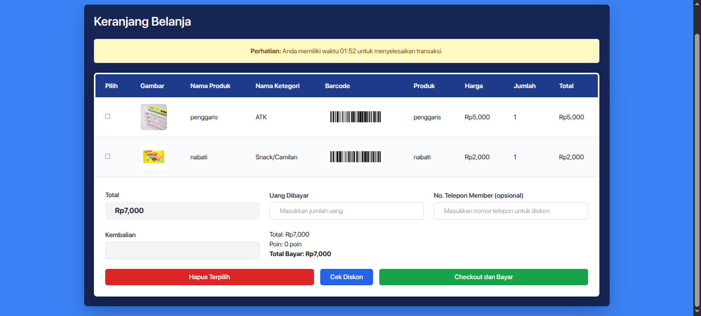
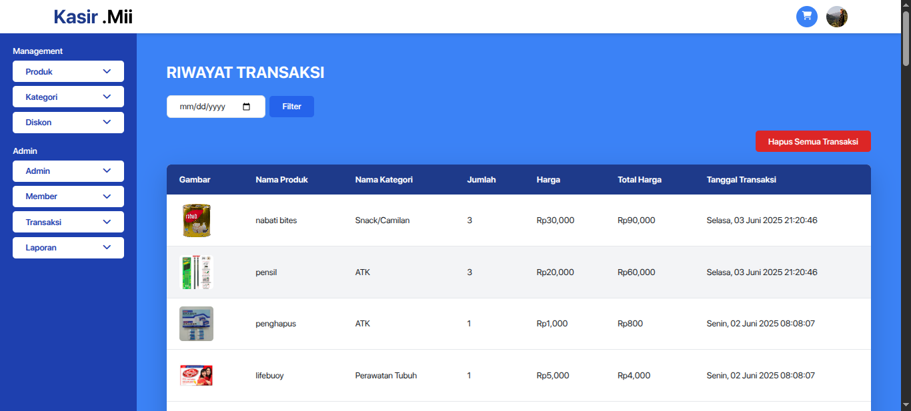

  

<h1 align="center" style="color:#4A4A4A;">PROJEK E - KASIR</h1>

  Sistem kasir digital yang dibuat untuk memudahkan proses transaksi di toko modern maupun UMKM.

---

### 📌 Informasi Siswa

-   **Nama** : FARIS HILMI AL - IZA
-   **Kelas** : XI RPL 2
-   **Jurusan** : REKAYASA PERANGKAT LUNAK

---

### 🎯 Deskripsi Projek

**E-Kasir** adalah aplikasi berbasis web yang dikembangkan dengan tujuan untuk:

-   Mempermudah proses pencatatan transaksi penjualan
-   Mengelola data produk, member, dan diskon
-   Menyediakan laporan penjualan yang akurat
-   Mendukung fitur export PDF dan pencetakan nota

---

### 🛠️ Teknologi yang Digunakan

-   **Laravel** – Backend Framework
-   **Tailwind CSS** – Styling UI
-   **JavaScript** – Interaktivitas halaman
-   **MariaDB** – Basis Data
-   **Apache2** – Web Server

---

### 📷 Tampilan Aplikasi

| Home                         | Dashboard                              | Produk                           |
| ---------------------------- | -------------------------------------- | -------------------------------- |
|  |  |  |

| Kategori                             | Diskon                           | Admin                          |
| ------------------------------------ | -------------------------------- | ------------------------------ |
|  |  |  |

| Member                           | Keranjang                         | Riwayat Transaksi                                      |
| -------------------------------- | --------------------------------- | ------------------------------------------------------ |
|  |  |  |
